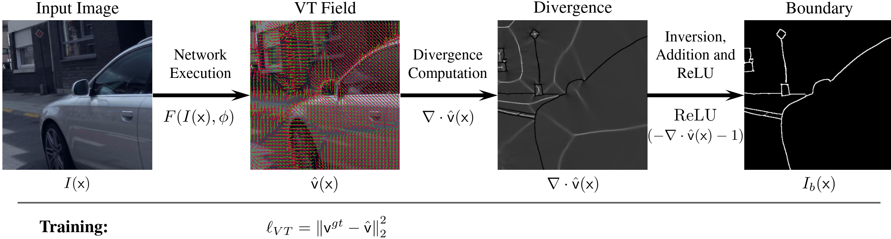

# Vector Transform (VT) Boundary Detection

[[OpenReview]](https://openreview.net/forum?id=nxcABL7jbQh)[[Arxiv]](https://arxiv.org/abs/2203.08795)



## Results

Results of VT representation on boundary detection 

| Dataset           | *assd*        | ODS F-Score   | OIS F-Score   |
| ----------------- |:-------------:|:-------------:|:-------------:|
| Cityscapes        | 4.33          | 0.845         | 0.846         |
| Mapillary Vistas  | 3.60          | 0.806         | 0.809         |
| Synthia           | 1.67          | 0.819         | 0.819         |

## Install Requirements and Datasets Structure

### Python Requirements

From an active conda installation create the environment through:
```
conda env create -f boundary_vt.yml
```
Additionally install the `detectron2` package.

### Datasets

The data-loader supports models with the following data structure:

```
datasets
├── <dataset_name>
│   ├── training
│   │   ├── <image_folder>
│   │   ├── <panoptic_folder>
│   │   ├── <vt_angle_folder>
│   │   └── <dt_folder>
│   ├── validation
│   │   ├── ...
│   │   ...
│   └── testing
│       ├── ...
│       ...
...
```

The names used in the folders should be added in the config file created for the desired dataset.
Furthermore, the `<dataset_name>` folder should be used as the `DATA_DIR` in the config file.
In the config file, it is also possible to indicate the extention of the saved files in each folder (for extentions that cannot be opened with PIL.Image, the data loader should be adapted).

With the folders set up as shown and a config file written following the example of `configs/cityscapes_field_extraction.yaml` the VT and DT can be extracted with the following script:

```
python field_extraction.py --config_file <dataset_field_extraction_config_file>
```

## Run Boundary Detection

### Train

With the config file adapted for the used dataset following the example of `configs/vt_cityscapes.yaml`, training (with checkpoint evaluation) can be done with the following script:

```
python main.py --config_file <config_file> --training -b 32
```

### Test

To evaluate a trained checkpoint it is necessary to adapt the config file setting `LOAD_CHECKPOINT: True` and the desired checkpoint epoch (e.g. `CHECKPOINT: "100"`). Then, it is possible to run testing with the following script:

```
python main.py --config_file <config_file> -b 1
```

## Citing

If you use the Vector Transform (VT) in your code, please use the following BibTeX entry.

```BibTeX
@inproceedings{
    rella2022zero,
    title={Zero Pixel Directional Boundary by Vector Transform},
    author={Edoardo Mello Rella and Ajad Chhatkuli and Yun Liu and Ender Konukoglu and Luc Van Gool},
    booktitle={International Conference on Learning Representations},
    year={2022},
    url={https://openreview.net/forum?id=nxcABL7jbQh}
}
```

## Acknowledgement

The code uses several pieces of open source code or libraries, such as [Detectron2](https://github.com/facebookresearch/detectron2), [HRNet](https://github.com/HRNet), [Panopric DeepLab](https://github.com/bowenc0221/panoptic-deeplab).
